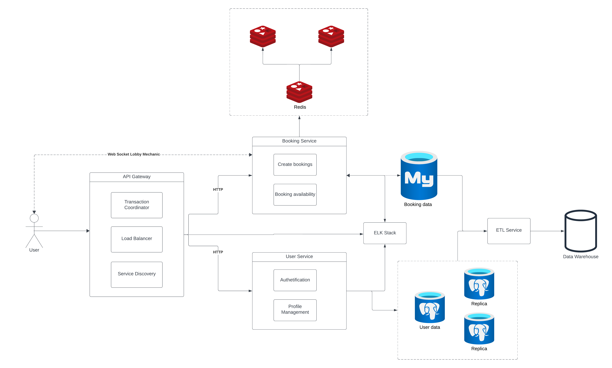

## Home Rental Platform
### 1. Application Suitability 

Microservices deliver flexibility and agility through modular architecture, fostering faster development cycles and easier maintenance.

- **Accelerate scalability**: DevOps teams seamlessly introduce new components without causing any downtime, thanks to the independent operation of each service within the microservices architecture. They can choose each service's best language or technology without compatibility concerns.

- **Improve fault isolation**: Microservices architecture is compartmentalized — if one service encounters a fault or failure, it doesn’t propagate across the entire system.

- **Quicker deployment time**: In monolithic architectures, changing necessitates redeploying the entire application. Microservices architecture enables faster releases because each service evolves and deploys independently, reducing the risk and time associated with coordinating changes across an entire application.

- **Increase Cost-efficiency**: Microservices architecture optimizes resource allocation and maintenance because teams work on small, well-defined services. Efforts are localized to specific services, reducing overall development and system maintenance costs.

**Real world example**: Platforms that this arhitecture are Airbnb, Vrbo, Zillow. These platforms are using this method to handle diffrent functionalities such as booking, porperty management, user profiles, and search.

### 2. Service Boundaries

- **Api Gateway**: acts as a single entry point for managing and facilitating API requests between clients and various backend services.

- **Load Balancer**: distributes incoming network traffic across multiple servers to ensure no single server becomes overwhelmed with too much demand. 

- **Service Discovery**: enables applications or services to automatically locate and connect to other services within a network

- **User Service**: handles user authetification and profile management.

- **Booking Service**: manages property bookings and real-time interactions.



### Updated features:

1. **Redis Clustering**: Redis clustering is used to enhance the caching layer by distributing data across multiple nodes, allowing for greater scalability and high availability, ensuring faster data retrieval and load balancing.

2. **ELK Stack**: The ELK Stack (Elasticsearch, Logstash, and Kibana) is implemented to collect, store, and visualize logs and metrics from services, aiding in real-time monitoring, troubleshooting, and analysis of the system’s performance.

3. **Database Replication**: Database replication in PostgreSQL involves creating replica nodes of the user data database, improving data availability, load balancing read operations, and enhancing fault tolerance.

4. **ETL Service**: The ETL (Extract, Transform, Load) service is used to transfer booking and user data from the MySQL and PostgreSQL databases into a data warehouse, supporting data analytics and reporting by consolidating and preparing data for analysis.

### 3. Technology Stack and Communication Patterns

- **Api Gateway**: Node.js/Express.js
- **User Service**: Python with Flask and PostgreSQL
- **Booking Service**: Python with Flask and MySQL
- **Communication Patterns**: REST
- **Cache**: REDIS

### 4. Data Management Design

#### **User Service:**

**1. POST** /api/users/login
- **Description:** Authenticates a user and provides a JWT token if credentials are valid.
- **Request Body**
```
{
  "email": "john@gmail.com",
  "password": "password"
}
```
**Successful Response 200 OK**
```
{
  "token": "<JWT_TOKEN>",
  "message": "Login successful"
}
```
**Failure Response 401 Unauthorized**
```
{
  "error": "Invalid credentials"
}
```

**2. POST** /api/users/register
- **Description:** Registers a new user with a username, email, and password.
- **Request Body:**
```
{
  "username": "username",
  "email": "user@example.com",
  "password": "password"
}

```
**Successful Response 201 Created**
```
{
  "message": "User registered successfully"
}

```
**Failure Response 409 Conflict**
```
{
  "error": "User already exists" 
}

```

**3. GET** /api/users/allusers
- **Description:** Retrieves a list of all registered users.
- **Successful Response 200 Ok**
```
{
  [
  {
    "id": 1,
    "username": "user1",
    "email": "user1@gmail.com"
  },
  {
    "id": 2,
    "username": "user2",
    "email": "user2@gmail.com"
  }
]
}
```
**4. GET** /api/users/profile
- **Description:** Returns profile information of the authenticated user.
- **Successful Response 200 Ok**
```
{
  "id": 3,
  "username": "john",
  "email": "john@gmail.com"
}

```
#### **Booking Service:**

**1. POST** /api/bookings/book
- **Description:** Creates a new booking for a specified user and property within a date range.
- **Request Body**
```
{
  "userId": 3,
  "propertyId": 2,
  "startDate": "2024-10-10",
  "endDate": "2024-10-15"
}
```
- **Successful Response 201 Created**
```
{
  "bookingId": 3,
  "message": "Booking confirmed",
  "totalPrice": 6300
}
```
- **Failure Response 404 Not Found**
```
{
    "message": "Property not found or not available"
}
```

**2. GET** /api/bookings/properties
- **Description:** Retrieves a list of available properties for booking.
**Successful Response 200 Ok**
```
{
  [
    {
        "availability": true,
        "location": "New York City NY",
        "name": "Modern City Apartment",
        "pricePerNight": 120,
        "propertyId": 1
    },
    {
        "availability": true,
        "location": "Malibu, CA",
        "name": "Oceanfront Luxury Villa",
        "pricePerNight": 450,
        "propertyId": 2
    },
    {
        "availability": true,
        "location": "Aspen, CO",
        "name": "Rustic Mountain Cabin",
        "pricePerNight": 180,
        "propertyId": 3
    },
    {
        "availability": true,
        "location": "Charleston, SC",
        "name": "Charming Country Cottage",
        "pricePerNight": 90,
        "propertyId": 4
    },
    {
        "availability": false,
        "location": "Chicago, IL",
        "name": "Downtown Penthouse",
        "pricePerNight": 600,
        "propertyId": 5
    }
]
}

```
**3. DELETE** /api/cancel-booking/{int:booking_id}
- **Description:** Cancels an existing booking with the specified ID.
- **Successful Response 200 Ok**
```
{
  "message": "Booking cancelled successfully"
}
```

**4. GET** /api/bookings/booking/{id}
- **Description:** Retrieves details of a specific booking by booking ID.
- **Successful Response 200 Ok**
```
{
  "bookingId": 1,
  "userId": 3,
  "propertyId": 2,
  "startDate": "2024-10-10",
  "endDate": "2024-10-15"
}
```
**Failure Response 404 Not Found**
```
{
  "error": "Booking not found"
}

```

### Web Socket Connection
```
ws://localhost:5001 - Users connect to the websocket
```
There are several events that could happen:
- get-notification
- stop-notification
- join-room
- leave-room
- broadcast_notification

**1. get-notification** 
- **Description:** Subscribes a user to receive notifications for a specific property based on the property ID.

- **Successful Response:** 
  - Emits notification_response with message "Subscribed to notification for property with ID:{property_id}".
  - Emits notification_response with message "Already watching notification for property with ID:{property_id}" if the user is already subscribed.

- **Failure Response:**  Emits notification_response with message "Error" if the property ID is missing.

**2. stop-notification** 
- **Description:** Unsubscribes a user from notifications for a specific property
- **Successful Response:** 
  - Emits stop_notification_response with message "Stopped getting notification for property with ID: {property_id}"

- **Failure Response:**  
  - Emits stop_notification_response with message "No notification found for this property id" if no subscription exists
  - Emits stop_notification_response with message "Error" if the property ID is missing

**3. join-room** 
- **Description:** Connects the user to a WebSocket room for receiving notifications about a specific property
- **Successful Response:** 
  - Emits join_response with message "Connected to room {property_id} for notifications" if subscribed

- **Failure Response:**  
  - Emits join_response with message "User {user_id} is not subscribed to get notifications for room: {property_id}" if no subscription is found
  - Emits join_response with message "Error" if the property ID is missing

**4. leave-room** 
- **Description:** Disconnects the user from the WebSocket room associated with a specific property
- **Successful Response:** 
  - Emits leave_response with message "Left from room {property_id}"

- **Failure Response:**  
  - Emits leave_response with message "User {user_id} did not get notification for property with ID: {property_id}" if the user is not subscribed
  - Emits leave_response with message "Error" if the property ID is missing

**5. broadcast-notification** 
- **Description:** Sends a notification update to all users in a specific room based on property ID
- **Successful Response:** 
  - Emits notification_update with message containing "update" for the notification

- **Failure Response:**  
  - Emits notification_update with message "Error" if the property ID or notification data is missing

### Running & Deploying
#### Installation

- **1. Clone the Repository**

```
git clone <repository_url>
cd <repository_directory>
```
- **2. Set Up a Virtual Environment**
```
python3 -m venv venv
venv\Scripts\activate 
```
- **3. Install Python Dependencies**
```
pip install -r requirements.txt
```

#### Deployment

- **1. Run Docker Compose**

Build the images and start the containers for all microservices.
```
docker-compose up --build
```

Check whether services are running
```
docker ps
```

Stop the containers

```
docker-compose down
```

### 5. Deployment and Scalling 
For this project I'll consider using containerization tool like Docker. It will allow me to package my microservices into containers that include the application code, libraries, and dependancies. Thus, each container runs in its own container, isolated from others. Also horizontal scalling will be used for this project.


