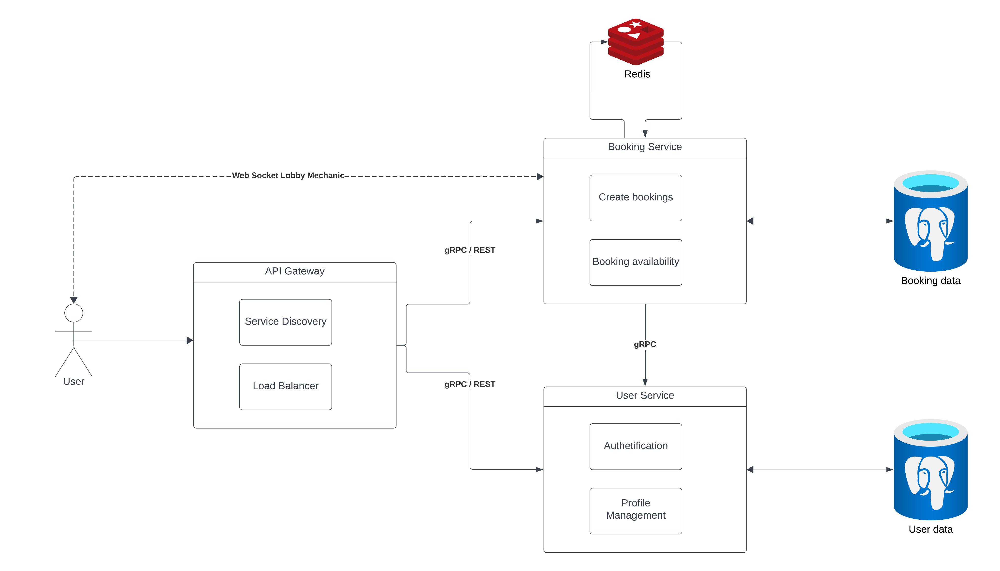

## Home Rental Platform

### 1. Application Suitability 

Microservices deliver flexibility and agility through modular architecture, fostering faster development cycles and easier maintenance.

- **Accelerate scalability**: DevOps teams seamlessly introduce new components without causing any downtime, thanks to the independent operation of each service within the microservices architecture. They can choose each service's best language or technology without compatibility concerns.

- **Improve fault isolation**: Microservices architecture is compartmentalized — if one service encounters a fault or failure, it doesn’t propagate across the entire system.

- **Quicker deployment time**: In monolithic architectures, changing necessitates redeploying the entire application. Microservices architecture enables faster releases because each service evolves and deploys independently, reducing the risk and time associated with coordinating changes across an entire application.

- **Increase Cost-efficiency**: Microservices architecture optimizes resource allocation and maintenance because teams work on small, well-defined services. Efforts are localized to specific services, reducing overall development and system maintenance costs.

**Real world example**: Platforms that this arhitecture are Airbnb, Vrbo, Zillow. These platforms are using this method to handle diffrent functionalities such as booking, porperty management, user profiles, and search.

### 2. Service Boundaries

- **Api Gateway**: acts as a single entry point for managing and facilitating API requests between clients and various backend services.

- **Load Balancer**: distributes incoming network traffic across multiple servers to ensure no single server becomes overwhelmed with too much demand. 

- **Service Discovery**: enables applications or services to automatically locate and connect to other services within a network

- **User Service**: handles user authetification and profile management.

- **Booking Service**: manages property bookings and real-time interactions.



### 3. Technology Stack and Communication Patterns

- **Api Gateway**: Node.js/Express.js
- **User Service**: Python with Flask and PostgreSQL
- **Booking Service**: Python with Flask and PostgreSQL
- **Communication Patterns**: REST
- **Cache**: REDIS

### 4. Data Management Design

#### **User Service:**

- Database: Each user has unique data stored in the PostgreSQL DB

**1. POST** /register ->  Registers a new user
```
{
  "username": "string",
  "email": "string",
  "password": "string"
}
```
**Response**
```
{
  "userId": "string",
  "message": "User successfully registered"
}
```

**2. POST** /login -> Logs in a user
```
{
  "email": "string",
  "password": "string"
}
```
**Response**
```
{
  "token": "string",
  "message": "Login successful"
}
```

**3. GET** /profile - > Retrieves user's profile information. The request header will require an authorization token(JWT)

```
{
  "userId": "string",
  "username": "string",
  "email": "string",
  "registeredDate": "string"
}
```

#### **Booking Service:**

**1. GET** /properties - > Retrieves the list of available properties

```
  {
    "propertyId": "string",
    "name": "string",
    "location": "string",
    "pricePerNight": "number",
    "availability": "boolean"
  }
```

**2. POST** /book -> Creates a new booking

```
{
  "propertyId": "string",
  "userId": "string",
  "startDate": "string",
  "endDate": "string"
}
```
**Response** 
```
{
  "bookingId": "string",
  "message": "Booking confirmed",
  "totalPrice": "number"
}
```

**3. GET** /booking {bookingID} -> Retrieves the details of a specific booking

```
{
  "bookingId": "string",
  "propertyId": "string",
  "userId": "string",
  "startDate": "string",
  "endDate": "string",
  "status": "string"
}
```

**4. POST** /cancel -> Cancels an existing booking
```
{
  "bookingId": "string"
}
```
**Response**
```
{
  "message": "Booking cancelled"
}
```

**5. GET** -> Retrieves the real-time availability of properties using the lobby mechanic. Opens a websocket to provide real-time availability updates

```
  {
    "propertyId": "string",
    "availableSlots": "number"
  }
```
### 5. Deployment and Scalling 

For this project I'll consider using containerization tool like Docker. It will allow me to package my microservices into containers that include the application code, libraries, and dependancies. Thus, each container runs in its own container, isolated from others. Also horizontal scalling will be used for this project.


